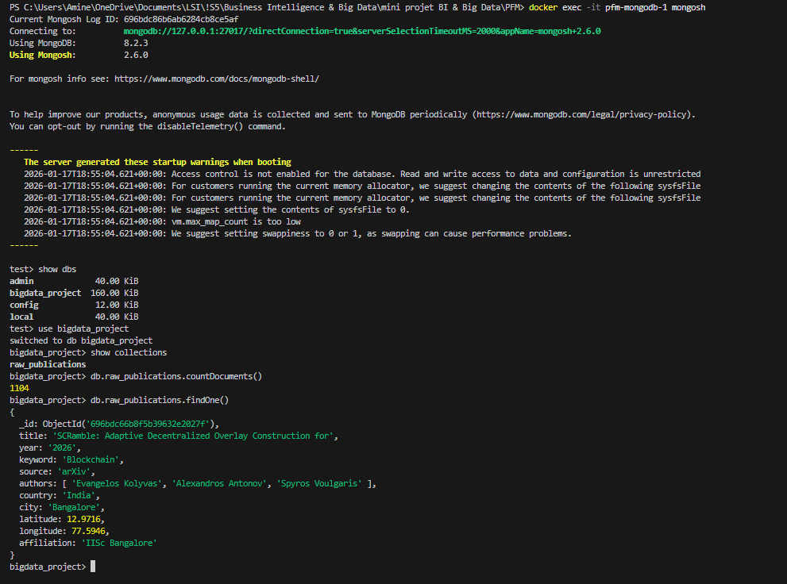

# Phase 2 : Stockage de Données (Data Storage)

Ce dossier concerne la deuxième étape du projet : le stockage des données volumineuses et hétérogènes collectées lors du Scraping.

Conformément aux spécifications techniques, nous utilisons une base de données **NoSQL MongoDB** pour stocker les articles scientifiques sous format JSON non structuré.

---

## 1. Architecture de Stockage

Pour garantir la portabilité et faciliter l'installation, le serveur MongoDB n'est pas installé directement sur la machine hôte mais est virtualisé via **Docker**.

* **Technologie :** MongoDB (Image `mongo:latest`)
* **Orchestration :** `docker-compose.yml` (situé à la racine du projet)
* **Port d'écoute :** `27017`

### Structure de la Base de Données
* **Nom de la BDD :** `bigdata_project`
* **Collection :** `raw_publications`

---

## 2. Configuration du Pipeline

L'insertion des données est automatisée via le pipeline Scrapy configuré à l'étape précédente. Le lien entre le collecteur (Scraper) et la base de données est défini dans le fichier `settings.py` :

* **URI de Connexion :** `MONGO_URI = 'mongodb://localhost:27017'`
* **Pipeline :** `ITEM_PIPELINES` est activé pour traiter et insérer les items automatiquement dès leur collecte.

---

## 3. Commandes de Vérification (Shell Mongo)

Voici la procédure pour valider que les données sont bien stockées dans le conteneur Docker.

### Étape 1 : Accès au Shell MongoDB
Au lieu d'utiliser un client local, nous nous connectons directement au shell à l'intérieur du conteneur Docker :

```bash
docker exec -it pfm-mongodb-1 mongosh
```

### Étape 2 : Séquence de Validation
Une fois dans l'invite de commande (`test>` ou `mongos>`), exécutez la séquence suivante :

1. **Lister les bases de données**
```javascript
show dbs
```
Résultat attendu : Doit afficher `bigdata_project` (avec une taille en ko/mb).

2. **Sélectionner la base du projet**
```javascript
use bigdata_project
```
Résultat attendu : `switched to db bigdata_project`.

3. **Vérifier la collection**
```javascript
show collections
```
Résultat attendu : Doit afficher `raw_publications`.

4. **Compter le nombre d'articles collectés**
```javascript
db.raw_publications.countDocuments()
```
Résultat attendu : Environ `1104` documents (selon le résultat du scraping).

5. **Inspecter un document (échantillon)**
```javascript
db.raw_publications.findOne()
```

**Note :** Cette commande est préférable à `db.raw_publications.find()` pour éviter d'inonder le terminal avec des milliers de lignes.

### Résultat de la Vérification



L'image ci-dessus montre la validation réussie du stockage avec 1104 documents dans la collection `raw_publications`.

---

## 4. Exportation (Optionnel)

Si nécessaire pour l'analyse Spark ou pour des sauvegardes manuelles, il est possible d'exporter les données en fichier JSON.

Cette commande est à lancer depuis votre terminal Linux/Bash (pas dans le shell Mongo) :

```bash
docker exec pfm-mongodb-1 mongoexport --db bigdata_project --collection raw_publications --out /tmp/publications.json
```

Pour récupérer le fichier exporté depuis le conteneur :
```bash
docker cp pfm-mongodb-1:/tmp/publications.json ./publications.json
```